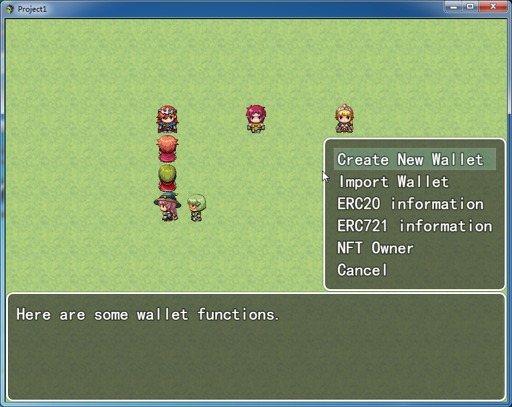

RPG Game Maker MV-Free-Cryptocurrency-Algo-Payment-Gateway
Algo Crypto Blockchian Plugin.
Free Plugin!
Recieve ETH,BNB,FTM,Matic,Moonriver.. or USDT,USDC,DAI(ERC20 token)... cryptocurrencies in your RPGMaker MV Games!
eth bnb ftm matic movr
RPGMaker Free Cryptocurrency Payment Gateway

How To Run Game Project
Download example project directly:
Example project

due to reduce the big size of project zip file ,"audio" and "img" folder are deleted,
you just need create a new RPG Maker Project, then copy "audio" and "img" folder to this project.
and then launch the Game.rpgproject.

*This plugin now support Ethereum,Binance,Polygon,Fantom,Moonriver,and Ropsten Test network.

How To Use( if you don't want download the game project)
1.Copy the "AlgoCryptoPayment.js" and "RS_InputDialog.js" files into your project's /js/plugins/ folder.
2.Activate plugin using the 'Plugin Manager'.
3.go to plugin manager,set the RPC URL

** Before test , make sure your crypto account have enough ETH/BNB/ Token / NFT **
Script command
RPGmaker crypto payment1

#### Create New wallet
``CreateWallet()``

#### Show Player's wallet
``ShowMyWallet()``

##### Show Infomation of ERC20 token
``InfoOfERC20(ERC20Address)``
``InfoOfERC20("0xFA9A0930D919657b00e208631c836B404B2da729")``

#### Check if Player is the owner of this NFT.
``ownerOf(TokenID,NFTContractAddress)``

``ownerOf(3,"0x8210be23eC496ABEbb55eD9243FEd11687Fc37d1")``
 3 is tokenID, "0x8210be23eC496ABEbb55eD9243FEd11687Fc37d1" is ERC721 token address
 

#### Send ETH/BNB... to Game Owner,and recive game coins
``SendBaseCoin(SendToAddress,SendAmount,GetGameCoins)``

``SendBaseCoin(  "0x7B70921a415eF9cCea9EFAA19EAB8E9860734c2f",0.01,1000 )``
 Send 0.01 ETH/BNB/matic to "0x7B70921a415eF9cCea9EFAA19EAB8E9860734c2f",and get 1000 Game Coins.
 

#### Send ERC20 Token(USDT,DAI,UNI...) to Game Owner,and recive game coins
``SendERC20(TokenAddress,TokenDecimals,SendAmount,SendTo,GetGameCoins)``

``SendERC20( "0xFA9A0930D919657b00e208631c836B404B2da729",18,1,"0x7B70921a415eF9cCea9EFAA19EAB8E9860734c2f",1000 )``
 Send 1 token (token address:"0xFA9A0930D919657b00e208631c836B404B2da729") to "0x7B70921a415eF9cCea9EFAA19EAB8E9860734c2f" ,and get 1000 Game Coins.
 

#### Transfer NFT
``safeTransferFrom(NFTAddress,FromAddress,ToAddress,TokenID)``

safeTransferFrom( "0x8210be23eC496ABEbb55eD9243FEd11687Fc37d1","0xb6A4c1C0af091aFFff0E7d4D8E09f2e400286e34","0x7B70921a415eF9cCea9EFAA19EAB8E9860734c2f",2 )

 
Newest Video totorial:
https://www.youtube.com/watch?v=LouoiSSDxSM
 

